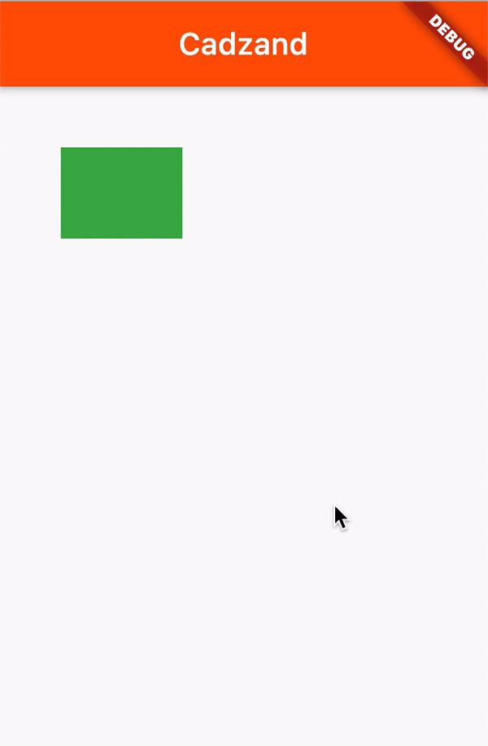

# coast


PageView wrapper supporting Hero-like animations



## Example

Create a `Coast` with a number of `Beaches` and add a `CrabController` as observer
to the `Coast`. Wrap a widget that you want to animate between beaches with a
`Crab` widget with the same `tag`.

```dart
class CoastExampleApp extends StatefulWidget {
  @override
  _CoastExampleAppState createState() => _CoastExampleAppState();
}

class _CoastExampleAppState extends State<CoastExampleApp> {
  final _beaches = [
    Beach(builder: (context) => Cadzand()),
    Beach(builder: (context) => Westkapelle()),
    Beach(builder: (context) => Zoutelande()),
  ];

  final _coastController = CoastController();

  @override
  Widget build(BuildContext context) {
    return MaterialApp(
      home: Coast(
        beaches: _beaches,
        controller: _coastController,
        observers: [
          CrabController(),
        ],
      ),
    );
  }
}


class Cadzand extends StatelessWidget {
  @override
  Widget build(BuildContext context) => Scaffold(
    appBar: AppBar(
      title: Text("Cadzand"),
      backgroundColor: Colors.deepOrange,
    ),
    body: Stack(
      children: [
        Positioned(
          top: 40,
          left: 40,
          child: Crab(
            tag: "container",
            child: Container(
              color: Colors.green,
              width: 80,
              height: 60,
            ),
          ),
        ),
      ],
    ),
  );
}

class Westkapelle extends StatelessWidget {
  @override
  Widget build(BuildContext context) => Scaffold(
    appBar: AppBar(
      title: Text("Westkapelle"),
      backgroundColor: Colors.amber,
    ),
    body: Stack(
      children: [
        Positioned(
          top: 80,
          right: 40,
          child: Crab(
            tag: "container",
            child: Container(
              color: Colors.green,
              width: 200,
              height: 100,
            ),
          ),
        ),
      ],
    ),
  );
}

class Zoutelande extends StatelessWidget {
  @override
  Widget build(BuildContext context) => Scaffold(
    appBar: AppBar(
      title: Text("Zoutelande"),
      backgroundColor: Colors.deepPurple,
    ),
    body: Stack(
      children: [
        Positioned(
          bottom: 40,
          left: 20,
          child: Crab(
            tag: "container",
            child: Container(
              color: Colors.green,
              width: 100,
              height: 200,
            ),
          ),
        ),
      ],
    ),
  );
}
```